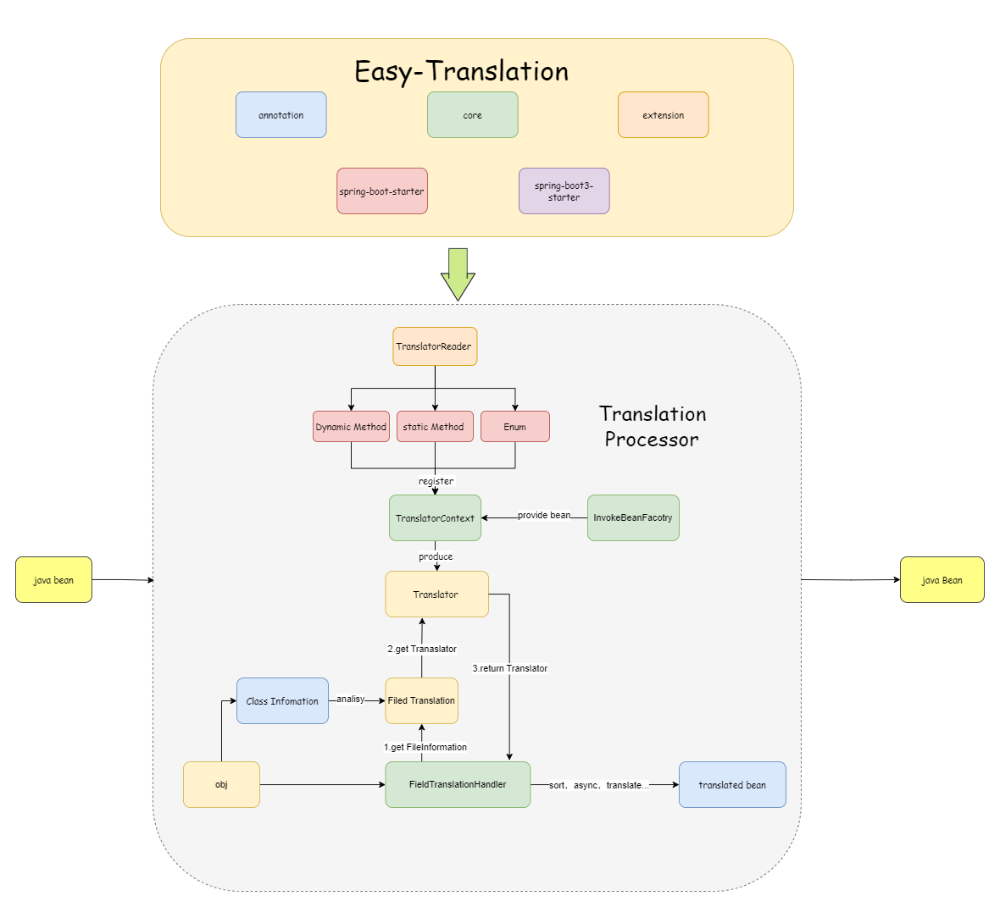

# 插件介绍  <small>最新版本:{{version}}</small>

[Easy-Translation](https://github.com/kkkele/easy-translation)是一款 `java` 对象属性自动填充插件。可手动控制开关，即插即用。无需多余配置，为简化开发，提升效率，提高代码复用率，降低耦合度而生。

## 特性

- **损耗小：**翻译功能由对象直接调用方法实现，而非反射调用，性能损耗小。
- **灵活性强：**可自定义编排字段翻译的**顺序** ，处理**参数和结果**，支持**异步翻译**，**批量翻译**，嵌套翻译。
- **批量翻译：**框架支持处理集合类，大幅减少IO操作。
- **序列化自动执行：**支持序列化时，自动翻译功能。
- **操作简单：**支持全注解操作，无任何复杂步骤。注解属性简单易懂。
- **扩展性强：**采用全组件设计，开发者不满意可随时替换组件。
- **开箱即用：**支持生态强大的SpringBoot，引入依赖，轻松使用。

## 插件结构

---

## 代码托管

---

> [Gitee](https://gitee.com/cai-zhiyuDaKeLe/easy-translation) | [Github](https://github.com/kkkele/easy-translation)

## 视频讲解

> 暂未出炉

